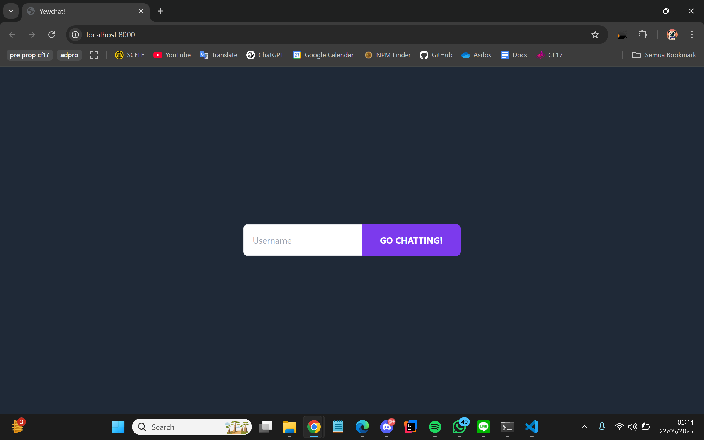
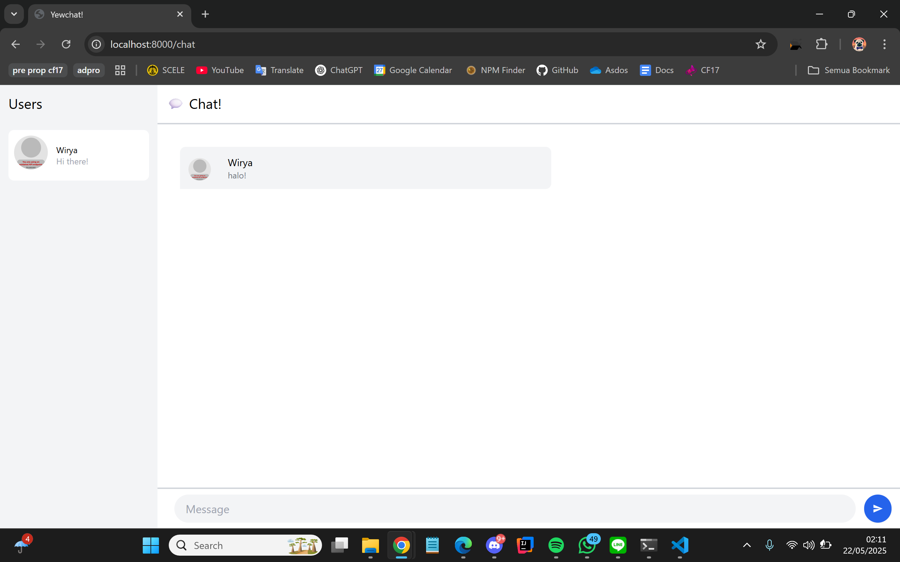
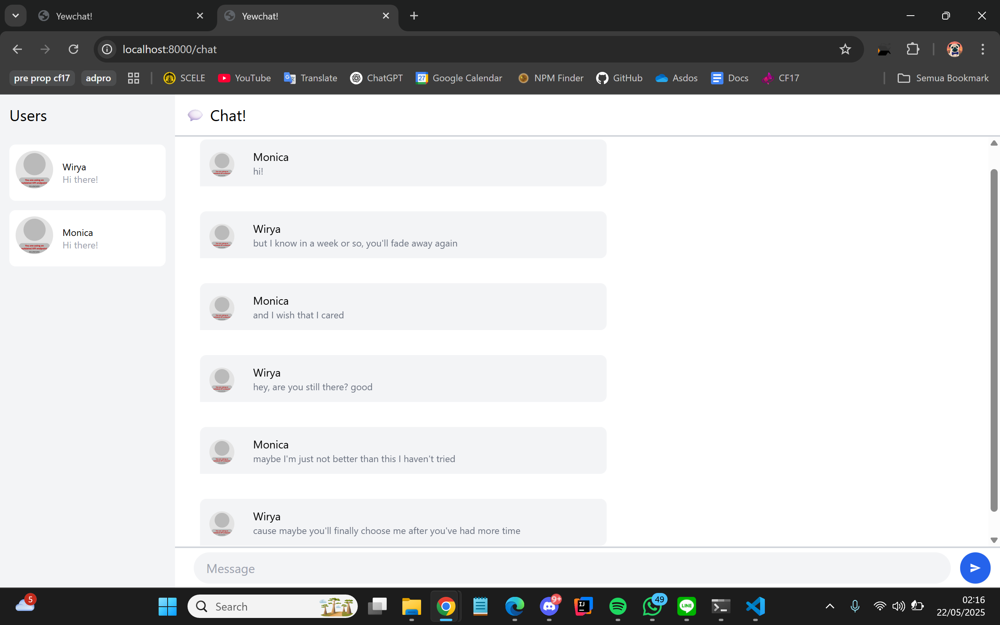
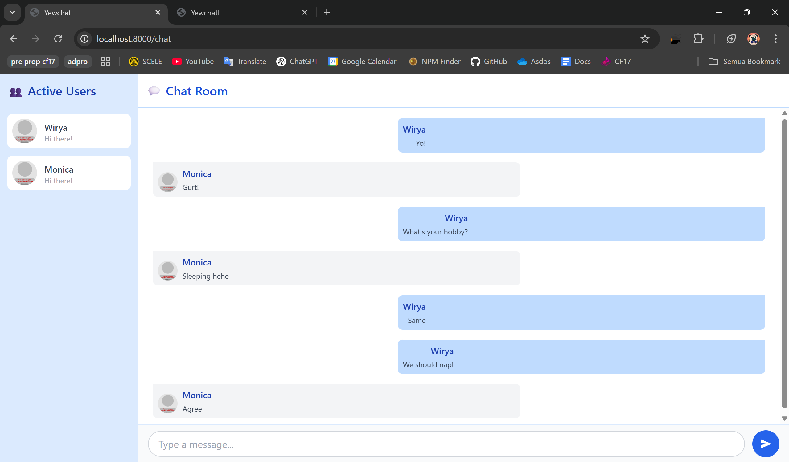

**Nama**: Wirya Dharma Kurnia    
**Kelas**: Adpro B   
**NPM**: 2306152115  

# Reflection

### 3.1: Original code

Tampilan page ketika pengguna pertama kali membuka aplikasi dan mengisi username.

Tampilan page ketika pengguna sudah masuk dan dapat mengirimkan pesan. Pada contoh ini, username penggunanya adalah "Wirya":

Tampilan page ketika beberapa pengguna bertukar pesan satu sama lain. Pada contoh ini, username penggunanya adalah "Wirya" dan "Monica":

### 3.2: Be creative

Saya melakukan beberapa perubahan yaitu sebagai berikut.
- Mengubah tulisan `Users` menjadi `👥 Active Users` dan `💬 Chat!` menjadi `💬 Chat Room` agar lebih menarik dan deskriptif.
- Mengubah sidebar menjadi berwarna biru muda.
- Mengubah bubble chat untuk user yang sedang log in (bubble chat diri sendiri) menjadi berwarna biru dan menghilangkan avatarnya.